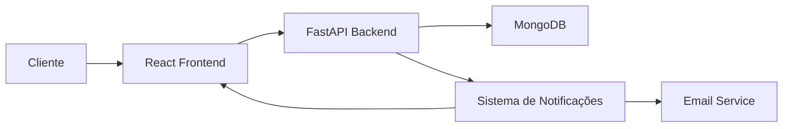
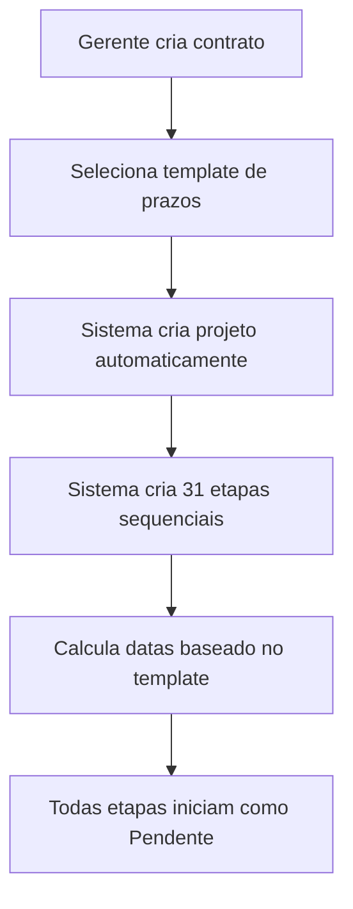
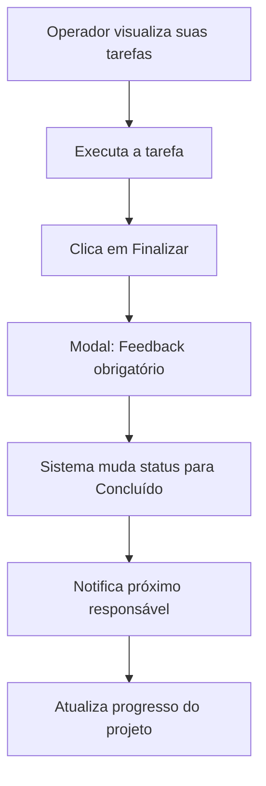
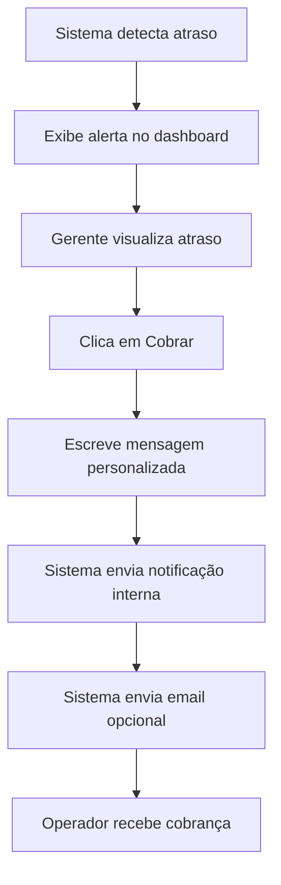

# 🎓 IDEIABH - Sistema de Gestão Operacional

Sistema completo de gerenciamento de projetos e contratos para a IDEIABH, especializado em gestão de formaturas e eventos acadêmicos.

<p align="center">
  
  
  
  
</p>

---

## 📋 Índice

- [Visão Geral](#-visão-geral)
- [Funcionalidades](#-funcionalidades)
- [Tecnologias](#-tecnologias)
- [Arquitetura](#-arquitetura)
- [Instalação](#-instalação)
- [Configuração](#-configuração)
- [Uso](#-uso)
- [API Endpoints](#-api-endpoints)
- [Estrutura do Projeto](#-estrutura-do-projeto)
- [Fluxo de Trabalho](#-fluxo-de-trabalho)
- [Contribuindo](#-contribuindo)
- [Licença](#-licença)

---

## 🎯 Visão Geral

O **IDEIABH** é uma solução completa para gerenciamento de projetos de formaturas, integrando:

- ✅ **Gestão de Contratos**: Criação e acompanhamento de contratos com clientes
- 📊 **Projetos Automatizados**: Geração automática de projetos com todas as etapas
- 📅 **Templates de Prazos**: Sistema de templates personalizáveis (padrão: 134 dias)
- 👥 **Departamentos**: Atendimento, Criação, Pré-Produção e Produção
- ⚡ **Alertas de Atrasos**: Monitoramento em tempo real de tarefas atrasadas
- 📧 **Sistema de Cobrança**: Notificações internas e por email para operadores
- 📈 **Relatórios Gerenciais**: Dashboards completos com KPIs e análises detalhadas

---

## ✨ Funcionalidades

### 🔐 Autenticação e Autorização
- Sistema de login/registro seguro
- Três níveis de permissão:
  - **Admin**: Acesso total ao sistema
  - **Gerente**: Gestão de equipes e cobranças
  - **Operador**: Execução de tarefas

### 📝 Gestão de Contratos
- Criação de contratos com informações completas
- Seleção de template de prazos (padrão ou personalizado)
- Geração automática de projeto ao criar contrato
- Criação automática de 31 etapas (ou conforme template)
- Cálculo automático de datas e prazos
- Visualização em cards modernos

### 📊 Projetos e Etapas
- Acompanhamento de progresso em tempo real
- 31 etapas divididas em 4 departamentos:
  - **Atendimento**: 12 etapas (80 dias)
  - **Criação**: 9 etapas (29 dias)
  - **Pré-Produção**: 4 etapas (14 dias)
  - **Produção**: 6 etapas (11 dias)
- Cálculo automático de risco (baixo, médio, alto, crítico)
- Histórico completo de alterações

### 📅 Templates de Prazos
- Template padrão IDEIABH (134 dias, 31 etapas)
- Criação de templates personalizados
- Visualização detalhada de etapas e prazos
- Aplicação automática ao criar contratos

### 🚨 Sistema de Alertas e Cobrança
- Detecção automática de tarefas atrasadas
- Alertas visuais no dashboard
- Sistema de cobrança para gerentes/admins:
  - Notificação interna no sistema
  - Envio de email (opcional)
  - Mensagem personalizada
- Histórico de cobranças

### 📈 Dashboard Gerencial
- KPIs em tempo real:
  - Total de projetos
  - Projetos em andamento
  - Tarefas atrasadas
  - Responsáveis com atraso
- Projetos em andamento com detalhes:
  - Progresso percentual
  - Nível de risco
  - Tarefas atrasadas
  - Datas previstas
- Alertas de atrasos priorizados
- Carga de trabalho por responsável
- Botão de cobrança rápida

### 🏢 Visualização por Departamento
- Visão específica para cada departamento
- Tarefas do setor com status
- Botão "Finalizar Etapa" para operadores
- Modal de feedback obrigatório ao finalizar
- Passagem automática para próxima etapa
- Timeline visual do andamento

### 📊 Relatórios Avançados
- **Gargalos**: Identificação de processos travados
- **Análise Semanal**: Produtividade da última semana
- **Análise Mensal**: Evolução e tendências
- **Por Responsável**: Desempenho individual
- **Por Setor**: Performance departamental
- **Tarefas Críticas**: Priorização de ações

---

## 🛠 Tecnologias

### Backend
- **FastAPI** (0.110.1) - Framework web moderno e rápido
- **Motor** (3.3.1) - Driver assíncrono do MongoDB
- **Pydantic** (2.6.4) - Validação de dados
- **Python-Jose** - Autenticação JWT
- **Bcrypt** - Criptografia de senhas
- **Uvicorn** - Servidor ASGI

### Frontend
- **React** (18.3.1) - Biblioteca UI
- **React Router** (6.x) - Roteamento
- **Tailwind CSS** (3.4) - Framework CSS
- **Shadcn/ui** - Componentes UI
- **Axios** - Cliente HTTP
- **Sonner** - Toast notifications
- **Lucide React** - Ícones
- **Recharts** - Gráficos

### Banco de Dados
- **MongoDB** (7.0) - Banco de dados NoSQL
- Collections:
  - `contratos` - Contratos de clientes
  - `projetos` - Projetos gerados
  - `tarefas` - Etapas dos projetos
  - `templates_prazos` - Templates de cronogramas
  - `notificacoes` - Sistema de notificações
  - `status_tarefas` - Status personalizáveis

### DevOps
- **Supervisor** - Gerenciamento de processos
- **Nginx** - Reverse proxy
- **Docker** - Containerização (opcional)

---

## 🏗 Arquitetura

```
┌─────────────────┐
│   FRONTEND      │
│   React + UI    │
│   Port 3000     │
└────────┬────────┘
         │
         │ HTTP/REST
         │
┌────────▼────────┐
│   BACKEND       │
│   FastAPI       │
│   Port 8001     │
└────────┬────────┘
         │
         │ Motor (async)
         │
┌────────▼────────┐
│   MONGODB       │
│   Port 27017    │
└─────────────────┘
```

### Fluxo de Dados



---

## 📦 Instalação

### Pré-requisitos

- **Python** 3.10+
- **Node.js** 18+
- **MongoDB** 7.0+
- **Yarn** ou **npm**

### Passo a Passo

#### 1. Clone o repositório

```bash
git clone https://github.com/seu-usuario/ideiabh.git
cd ideiabh
```

#### 2. Configure o Backend

```bash
cd backend

# Crie ambiente virtual
python -m venv venv
source venv/bin/activate  # Linux/Mac
# ou
venv\Scripts\activate  # Windows

# Instale dependências
pip install -r requirements.txt

# Configure variáveis de ambiente
cp .env.example .env
# Edite .env com suas configurações
```

#### 3. Configure o Frontend

```bash
cd frontend

# Instale dependências
yarn install
# ou
npm install

# Configure variáveis de ambiente
cp .env.example .env
# Edite .env com suas configurações
```

#### 4. Inicie o MongoDB

```bash
# Com Docker
docker run -d -p 27017:27017 --name mongodb mongo:7.0

# Ou instale localmente
# Siga: https://www.mongodb.com/docs/manual/installation/
```

---

## ⚙️ Configuração

### Backend (.env)

```env
# MongoDB
MONGO_URL=mongodb://localhost:27017
DB_NAME=ideiabh

# CORS
CORS_ORIGINS=http://localhost:3000,http://localhost:3001

# JWT
SECRET_KEY=your-secret-key-here
ALGORITHM=HS256
ACCESS_TOKEN_EXPIRE_MINUTES=30

# Email (opcional)
SMTP_HOST=smtp.gmail.com
SMTP_PORT=587
SMTP_USER=your-email@gmail.com
SMTP_PASSWORD=your-app-password
```

### Frontend (.env)

```env
# Backend URL
REACT_APP_BACKEND_URL=http://localhost:8001

# App Config
REACT_APP_NAME=IDEIABH
REACT_APP_VERSION=1.0.0
```

---

## 🚀 Uso

### Desenvolvimento

#### Backend

```bash
cd backend
source venv/bin/activate
uvicorn server:app --reload --host 0.0.0.0 --port 8001
```

Backend estará disponível em: `http://localhost:8001`

API Docs (Swagger): `http://localhost:8001/docs`

#### Frontend

```bash
cd frontend
yarn start
# ou
npm start
```

Frontend estará disponível em: `http://localhost:3000`

### Produção

#### Com Supervisor

```bash
# Instale supervisor
sudo apt-get install supervisor

# Copie configurações
sudo cp supervisord.conf /etc/supervisor/conf.d/ideiabh.conf

# Inicie serviços
sudo supervisorctl reread
sudo supervisorctl update
sudo supervisorctl start all
```

#### Com Docker

```bash
# Build
docker-compose build

# Start
docker-compose up -d

# Logs
docker-compose logs -f

# Stop
docker-compose down
```

---

## 📡 API Endpoints

### Autenticação

```
POST   /api/auth/login        - Login de usuário
POST   /api/auth/register     - Registro de usuário
GET    /api/auth/me           - Dados do usuário atual
```

### Contratos

```
GET    /api/contratos         - Listar contratos
POST   /api/contratos         - Criar contrato (+ projeto + etapas)
GET    /api/contratos/:id     - Obter contrato específico
PUT    /api/contratos/:id     - Atualizar contrato
DELETE /api/contratos/:id     - Deletar contrato (admin)
```

### Projetos

```
GET    /api/projetos          - Listar projetos
GET    /api/projetos/:id      - Obter projeto com tarefas
```

### Tarefas (Etapas)

```
GET    /api/tarefas           - Listar tarefas (com filtros)
POST   /api/tarefas           - Criar tarefa manual
GET    /api/tarefas/:id       - Obter tarefa específica
PUT    /api/tarefas/:id       - Atualizar tarefa
POST   /api/tarefas/:id/finalizar        - Finalizar tarefa
POST   /api/tarefas/:id/alterar-status   - Alterar status
DELETE /api/tarefas/:id       - Deletar tarefa (admin)
```

### Templates de Prazos

```
GET    /api/templates-prazos              - Listar templates
POST   /api/templates-prazos              - Criar template (admin)
GET    /api/templates-prazos/:id          - Obter template
PUT    /api/templates-prazos/:id          - Atualizar template (admin)
DELETE /api/templates-prazos/:id          - Deletar template (admin)
POST   /api/templates-prazos/criar-padrao - Criar template padrão
```

### Notificações

```
GET    /api/notificacoes/:usuario_id      - Listar notificações
POST   /api/notificacoes                  - Criar notificação
PUT    /api/notificacoes/:id/marcar-lida  - Marcar como lida
```

### Sistema de Cobrança

```
POST   /api/cobrar-operador   - Enviar cobrança (gerente/admin)
```

### Dashboard e Relatórios

```
GET    /api/dashboard-avancado     - Dashboard completo
GET    /api/dashboard-stats        - Estatísticas gerais
GET    /api/tarefas-atrasadas      - Tarefas atrasadas
GET    /api/atrasos-por-setor      - Atrasos agrupados por setor
GET    /api/atrasos-por-projeto/:id - Atrasos de um projeto
GET    /api/relatorio-gargalos     - Relatório de gargalos
GET    /api/relatorio-semanal      - Análise semanal
GET    /api/relatorio-mensal       - Análise mensal
```

### Exemplo de Requisição

```bash
# Criar contrato com projeto e etapas
curl -X POST "http://localhost:8001/api/contratos" \
  -H "Content-Type: application/json" \
  -d '{
    "cliente": "Universidade Federal de MG",
    "faculdade": "Engenharia Civil",
    "numero_contrato": "2025-001",
    "valor": 45000.00,
    "data_inicio": "2025-02-01",
    "template_id": "template-padrao-id",
    "criado_por": "admin"
  }'
```

Resposta:

```json
{
  "contrato": {
    "id": "contrato-uuid",
    "cliente": "Universidade Federal de MG",
    "projeto_id": "projeto-uuid",
    "template_nome": "Template Padrão IDEIABH",
    "status": "Ativo"
  },
  "projeto": {
    "id": "projeto-uuid",
    "contrato_id": "contrato-uuid",
    "cliente": "Universidade Federal de MG",
    "progresso": 0.0,
    "prazo_total_dias": 134
  },
  "tarefas_criadas": 31,
  "message": "Contrato, projeto e 31 etapas criados com sucesso!"
}
```

---

## 📁 Estrutura do Projeto

```
ideiabh/
│
├── backend/
│   ├── server.py              # Aplicação FastAPI principal
│   ├── requirements.txt       # Dependências Python
│   ├── .env                   # Variáveis de ambiente
│   └── README.md
│
├── frontend/
│   ├── public/
│   ├── src/
│   │   ├── components/        # Componentes React
│   │   │   ├── ui/           # Componentes UI (Shadcn)
│   │   │   ├── Layout.jsx
│   │   │   └── ...
│   │   ├── pages/            # Páginas da aplicação
│   │   │   ├── DashboardAvancado.jsx
│   │   │   ├── ContratosListaNova.jsx
│   │   │   ├── ProjetosVisaoGeral.jsx
│   │   │   ├── DepartamentoView.jsx
│   │   │   ├── Relatorios.jsx
│   │   │   └── ...
│   │   ├── services/         # API services
│   │   │   └── api.js
│   │   ├── context/          # Contextos React
│   │   │   ├── AuthContext.js
│   │   │   └── ThemeContext.js
│   │   ├── hooks/            # Custom hooks
│   │   ├── App.js            # App principal
│   │   └── index.js          # Entry point
│   ├── package.json
│   ├── tailwind.config.js
│   └── .env
│
├── tests/                     # Testes automatizados
├── docs/                      # Documentação adicional
├── .gitignore
├── docker-compose.yml         # Docker compose
├── supervisord.conf           # Configuração Supervisor
└── README.md                  # Este arquivo
```

---

## 🔄 Fluxo de Trabalho

### 1. Criação de Contrato



### 2. Execução de Etapas



### 3. Sistema de Cobrança



---

## 🎨 Demonstração

### Dashboard Gerencial


- KPIs em tempo real
- Projetos em andamento
- Alertas de atrasos
- Carga por responsável

### Criação de Contrato


- Modal intuitivo
- Seleção de template
- Preview de etapas
- Cálculo automático de prazos

### Visualização de Departamento


- Timeline de etapas
- Botão finalizar
- Feedback obrigatório
- Histórico completo

---

## 🧪 Testes

### Backend

```bash
cd backend
pytest tests/ -v
pytest tests/ --cov=. --cov-report=html
```

### Frontend

```bash
cd frontend
yarn test
yarn test --coverage
```

### E2E

```bash
# Com Playwright
npx playwright test

# Com Cypress
npx cypress open
```

---

## 📊 Métricas e KPIs

O sistema rastreia automaticamente:

- **Projetos**: Total, em andamento, finalizados
- **Tarefas**: Total, concluídas, atrasadas, em dia
- **Performance**: Taxa de conclusão, média de atraso
- **Equipe**: Carga de trabalho, produtividade
- **Departamentos**: Gargalos, eficiência
- **Clientes**: Satisfação, entregas no prazo

---

## 🤝 Contribuindo

Contribuições são bem-vindas! Siga estas etapas:

1. Fork o projeto
2. Crie sua feature branch (`git checkout -b feature/AmazingFeature`)
3. Commit suas mudanças (`git commit -m 'Add some AmazingFeature'`)
4. Push para a branch (`git push origin feature/AmazingFeature`)
5. Abra um Pull Request

### Guia de Estilo

- **Python**: Siga PEP 8
- **JavaScript/React**: Siga Airbnb Style Guide
- **Commits**: Use Conventional Commits

---

## 🐛 Troubleshooting

### Backend não inicia

```bash
# Verifique MongoDB
sudo systemctl status mongodb

# Verifique logs
tail -f /var/log/supervisor/backend.err.log

# Reinstale dependências
pip install -r requirements.txt --force-reinstall
```

### Frontend não compila

```bash
# Limpe cache
rm -rf node_modules yarn.lock
yarn install

# Ou com npm
rm -rf node_modules package-lock.json
npm install
```

### Erro de conexão MongoDB

```bash
# Teste conexão
mongosh "mongodb://localhost:27017/ideiabh"

# Verifique URL no .env
cat backend/.env | grep MONGO_URL
```

---

## 📝 Changelog

### [1.0.0] - 2025-01-23

#### Adicionado
- ✅ Sistema completo de contratos e projetos
- ✅ Criação automática de etapas ao criar contrato
- ✅ Templates de prazos personalizáveis
- ✅ Dashboard gerencial avançado
- ✅ Sistema de alertas e cobrança
- ✅ Visualização por departamento
- ✅ Relatórios gerenciais
- ✅ Sistema de notificações
- ✅ Histórico completo de ações
- ✅ Cálculo automático de risco e progresso

#### Melhorado
- 🔧 Performance do dashboard
- 🔧 UI/UX dos modais
- 🔧 Sistema de filtros

---

## 📞 Suporte

- **Email**: suporte@ideiabh.com.br
- **Website**: https://www.ideiabh.com.br
- **Documentação**: https://docs.ideiabh.com.br
- **Issues**: https://github.com/ideiabh/sistema/issues

---

## 📄 Licença

Este projeto está sob a licença MIT. Veja o arquivo [LICENSE](LICENSE) para mais detalhes.

---

## 👥 Equipe

- **Backend**: Desenvolvido com FastAPI e MongoDB
- **Frontend**: React + Tailwind CSS + Shadcn/ui
- **DevOps**: Docker + Supervisor + Nginx

---

## 🙏 Agradecimentos

- Time IDEIABH por feedback e testes
- Comunidade Open Source
- Todos os contribuidores

---

<p align="center">
  Feito com ❤️ pela equipe IDEIABH
</p>

<p align="center">
  <a href="#-ideiabh---sistema-de-gestão-operacional">Voltar ao topo ⬆️</a>
</p>
